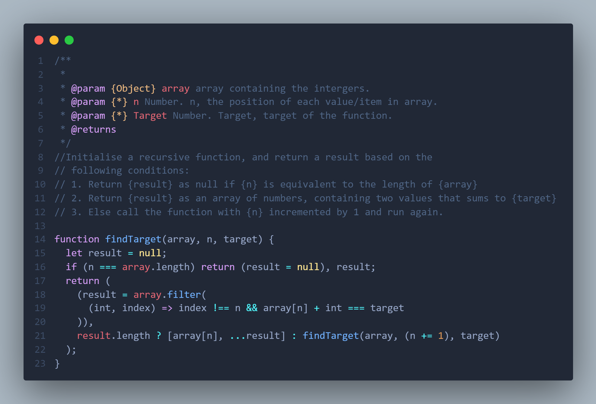

## Question

**Given an array of integers nums and an integer target, create a function that returns the two numbers such that they add up to target**

## Solution

### Explanation

Initialise a recursive function, and return a result based on the
following conditions:

1. Return {result} as null if {n} is equivalent to the length of {array}
2. Return {result} as an array of numbers, containing two values that sums to {target}
3. Call function with {n} incremented by 1 and run again.

### Code

`
@param {Object} array array containing the intergers.
@param {_} n Number. n, the position of each value/item in array.
@param {_} Target Number.
@returns null || Object

                function findTarget(array, n, target) {
                let result = null;
                if (n === array.length) return (result = null), result;
                return (
                    (result = array.filter(
                    (int, index) => index !== n && array[n] + int === target
                    )),
                    result.length ? [array[n], ...result] : findTarget(array, (n += 1), target)
                );
                }

`

### Screenshot

